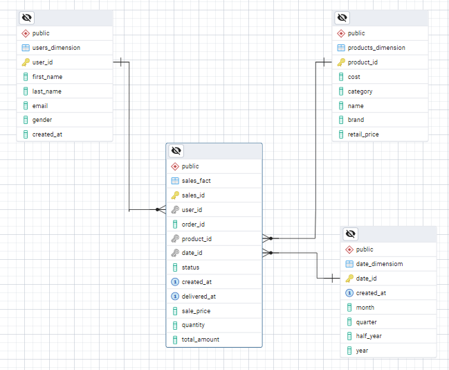

# E-Commerce Data Warehousing & ETL Pipeline with PySpark

## Project Overview
This project demonstrates the design of a centralized **Data Warehouse** architecture and the implementation of an automated **ETL (Extract, Transform, Load)** pipeline. The primary goal is to convert raw, scattered e-commerce transaction data into an optimized **Star Schema** using big data processing technologies to support Business Intelligence (BI) needs

## Repository Structure
```
├── DM_Adhi-Rizqi.ipynb   # Main Notebook (ETL & Data Modeling process)
├── dataset/              # Folder containing raw CSV data (inventory_items, order_items, orders, products, users)
├── Data Modelling.png   # Screenshot of the final processed data
└── README.md             # Project documentation
```

## Background (Case Study)
In large-scale e-commerce operations, raw data alone is insufficient for rapid decision-making. To avoid overloading operational databases, a structured Data Warehouse is essential. This project builds a foundation that allows analysts to query sales trends and customer behavior efficiently.

## Workflow
The project follows a standard industry data engineering methodology:
    - **Identify Grain**: Establishing that each row in the fact table represents one product item within a unique transaction to maintain the highest level of detail (atomic grain).
    - **Extraction**: Loading raw datasets (Users, Products, Sales) into a PySpark environment.
    - **Transformation**:
        - **Data Cleansing**: Handling null values and duplicates.
        - **Dimensional Modeling**: Restructuring data into dimension tables (users, products, date).
        - **Fact Table Creation**: Building the sales_fact table to link all dimensions with quantitative metrics.
    - **Loading**: Automating the data transfer to a PostgreSQL database using JDBC connectivity.

## Tech Stack
- **Processing Engine**: PySpark (Apache Spark)
- **Storage (Warehouse)**: PostgreSQL
- **Language**: Python
- **Integration**: JDBC Driver

## Data Modeling (Star Schema)

The resulting warehouse structure consists of:
    1. **sales_fact**: Central table storing transaction metrics (Quantity, Price).
    2. **users_dimension**: Descriptive data about the customers.
    3. **products_dimension**: Product details, categories, and pricing.
    4. **date_dimension**: Time attributes broken down by Day, Month, Quarter, and Year for trend analysis.

## Key Outcomes:
- `Schema Optimization`: The Star Schema significantly reduces query complexity for business reporting.
- `Advanced Transformation`: Using PySpark allows for scalable processing of time attributes into a comprehensive date dimension.
- `Analytical Readiness`: The data in PostgreSQL is fully prepared for connection to visualization tools like Tableau, Power BI, or Looker.

## Results


## How to Use
1. Set up a **PostgreSQL** instance.
2. Ensure **Java** and **Apache Spark** are installed in your environment.
3. Install dependencies: `pip install pyspark`.
4. Configure your database credentials in the **DM_Adhi-Rizqi.ipynb** notebook.
5. Execute the notebook to trigger the **ETL** pipeline.

## Contact
For questions or collaboration, please contact Adhi Rizqi Alfaqih via [LinkedIn](https://www.linkedin.com/in/adhirizqi/) or GitHub.
