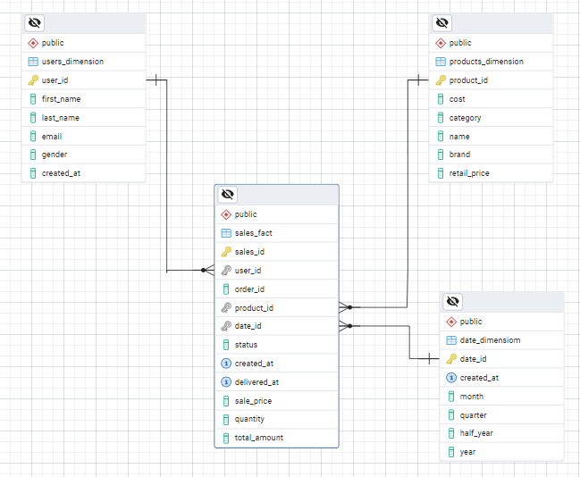

# E-Commerce Data Warehousing & ETL Pipeline with PySpark


---

## Project Overview

This project demonstrates the end-to-end design of a centralized **Data Warehouse** and the implementation of a fully automated **ETL (Extract, Transform, Load)** pipeline. Raw, scattered e-commerce transaction data from the *TheLook* dataset is ingested, cleaned, and restructured into an optimized **Star Schema** using PySpark, then loaded into PostgreSQL to support Business Intelligence (BI) reporting.

---

## Repository Structure

```
├── DM_Adhi-Rizqi_Final.ipynb   # Main notebook — ETL pipeline & data modeling
├── dataset/                    # Raw CSV source files
│   ├── thelook_ecommerce.users.csv
│   ├── thelook_ecommerce.products.csv
│   ├── thelook_ecommerce.order_items.csv
│   ├── thelook_ecommerce.orders.csv
│   └── thelook_ecommerce.inventory_items.csv
├── Data_Modelling.png          # Star Schema diagram (final output)
└── README.md                   # Project documentation
```

---

## Background

In large-scale e-commerce operations, raw transactional data alone is insufficient for rapid, reliable decision-making. Querying production databases directly creates performance bottlenecks and risks data integrity. A dedicated **Data Warehouse** decouples analytical workloads from operational systems, enabling analysts to query sales trends, customer behavior, and product performance efficiently.

---

## Data Modeling — Star Schema

The warehouse is built around the following schema:

```
                  ┌──────────────────────┐
                  │   users_dimension    │
                  │  PK: user_id         │
                  └──────────┬───────────┘
                             │
┌──────────────────┐  ┌──────▼────────────────┐  ┌──────────────────────┐
│  date_dimension  │  │      sales_fact        │  │  products_dimension  │
│  PK: date_id     ├──┤  FK: user_id           ├──┤  PK: product_id      │
└──────────────────┘  │  FK: product_id        │  └──────────────────────┘
                      │  FK: date_id           │
                      │  sale_price            │
                      │  quantity              │
                      │  total_amount          │
                      └────────────────────────┘
```

| Table | Type | Description |
|---|---|---|
| `sales_fact` | Fact | Central transaction records; links all dimensions with quantitative metrics |
| `users_dimension` | Dimension | Customer demographics (name, gender, email) |
| `products_dimension` | Dimension | Product catalog (name, brand, category, cost, retail price) |
| `date_dimension` | Dimension | Engineered time attributes — month, quarter, half-year, year |

**Grain:** Each row in `sales_fact` represents **one product item within a unique order** (atomic grain).

---

## ETL Workflow

```
 [Raw CSV Files]
       │
       ▼
  EXTRACT (PySpark)
       │
       ▼
  TRANSFORM
  ├── Data Cleansing    (null imputation, duplicate removal, type casting)
  ├── Dimensional Model (users, products, date dimension tables)
  └── Fact Table Build  (quantity aggregation, total_amount, FK joins)
       │
       ▼
  LOAD (PostgreSQL via JDBC)
  ├── users_dimension
  ├── products_dimension
  ├── date_dimension
  └── sales_fact
```

### Key Transformation Steps

1. **`users_dimension`** — Drop geolocation and traffic columns irrelevant to sales; remove duplicates; rename `id` → `user_id`.
2. **`products_dimension`** — Drop logistics columns; cast `cost` to `float`; impute missing `name` and `brand` with `'Unknown'`; rename `id` → `product_id`.
3. **`date_dimension`** — Engineered from `order_items.created_at`: extracts `month`, `quarter`, `half_year`, and `year`; generates a surrogate `date_id` via `monotonically_increasing_id()`.
4. **`sales_fact`** — Aggregates `quantity` (item count) and `total_amount` (sum of `sale_price`) per `(order_id, product_id)`; joins all dimension foreign keys; selects final business-relevant columns.

---

## Tech Stack

| Component | Technology |
|---|---|
| Processing Engine | Apache Spark (PySpark) |
| Data Warehouse | PostgreSQL 15 |
| Language | Python 3.12 |
| DB Connectivity | JDBC (`org.postgresql:postgresql:42.6.0`) |
| Dataset | [TheLook E-Commerce](https://console.cloud.google.com/marketplace/product/bigquery-public-data/thelook-ecommerce) (Google BigQuery Public Data) |

---

## Results

The final Star Schema, as loaded into PostgreSQL:



---

## How to Run

### Prerequisites

- Python 3.8+
- Java 8 or 11 (required by Apache Spark)
- Apache Spark 3.x
- A running PostgreSQL instance

### Setup

```bash
# 1. Install Python dependencies
pip install pyspark

# 2. Clone the repository
git clone https://github.com/adhirizqi/<repo-name>.git
cd <repo-name>

# 3. Place raw CSV files inside the dataset/ folder

# 4. Open the notebook
jupyter notebook DM_Adhi-Rizqi_Final.ipynb
```

### Configuration

In the notebook, update the PostgreSQL credentials in **Section 8 — Load to PostgreSQL**:

```python
POSTGRES_URL = "jdbc:postgresql://<HOST>:<PORT>/<DATABASE>"

POSTGRES_PROPS = {
    "user"    : "<YOUR_USERNAME>",
    "password": "<YOUR_PASSWORD>",
    "driver"  : "org.postgresql.Driver"
}
```

### Execution

Run all notebook cells sequentially. The pipeline will:
1. Load raw CSV files into PySpark DataFrames
2. Apply all transformations
3. Write the four final tables to your PostgreSQL database

---

## Key Outcomes

- **Schema Optimization** — Star Schema reduces query complexity for business reporting compared to a flat or normalized OLTP schema.
- **Scalable Processing** — PySpark's distributed engine handles data volumes beyond single-machine memory limits.
- **Analytical Readiness** — The PostgreSQL warehouse is ready for direct connection to BI tools such as Tableau, Power BI, Metabase, or Looker.
- **Data Integrity** — Missing values handled via imputation; duplicates removed; all foreign key relationships validated through join logic.

---

## Contact

**Adhi Rizqi Alfaqih**  
[](https://www.linkedin.com/in/adhirizqi/)
[](https://github.com/adhirizqi)
